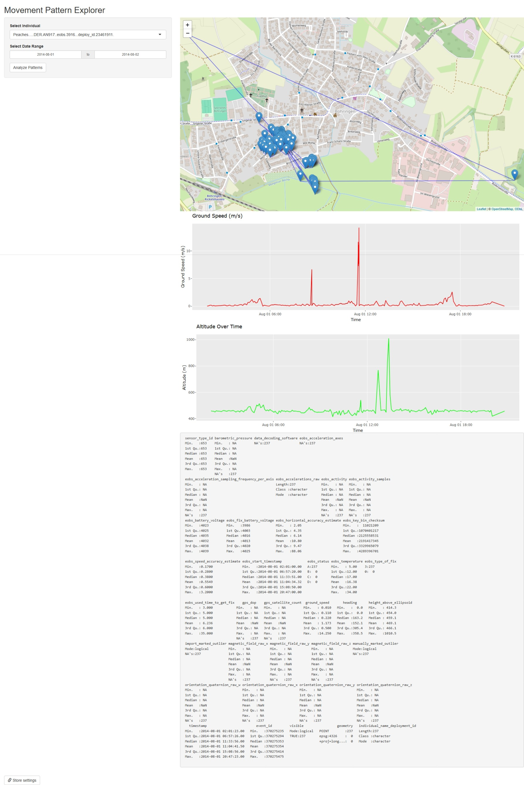

# Movement Pattern Explorer

## Overview

Movement Pattern Explorer is a MoveApp built with R Shiny that enables users to interactively explore and visualize animal movement data from Movebank. The App receives a MoveStack as input, allows filtering by individual and date range, displays movement tracks on an interactive map, and shows speed and altitude trends.

## Files Modified

- **ShinyModule.R**: Contains the UI and server logic for the App.
- **appspec.json**: Defines the App's metadata, input/output configuration, and dependencies.
- **README.md**: This documentation file.
- **renv.lock**: (Optional) For dependency management using renv.

For more info please check [Dveloper Readme for R_Shiny_App](https://github.com/movestore/Template_R_Shiny_App/blob/master/developer_README.md)

## Testing Locally

1. Place a sample Movebank data in `data/raw/`.
2. Ensure your SDK environment is configured (check **.env**).
3. Use **sdk.R** to run your App locally:
   - Open **sdk.R** in RStudio and run it.
   - The SDK will simulate the MoveStack input and display your App for local testing.

## Sample output

